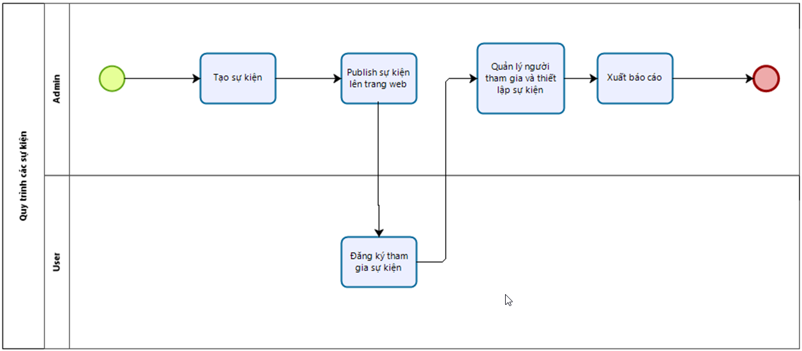
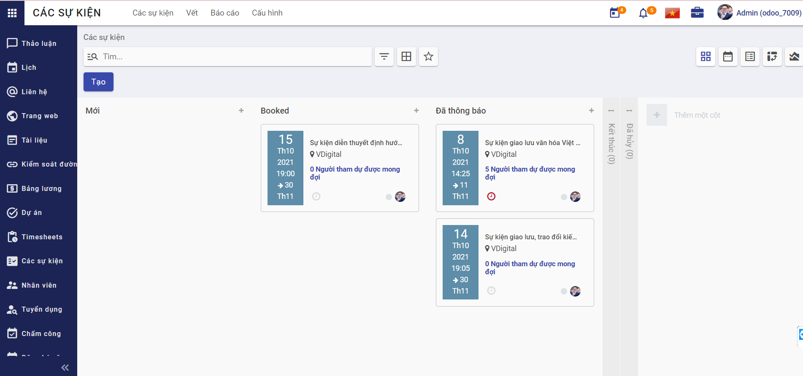
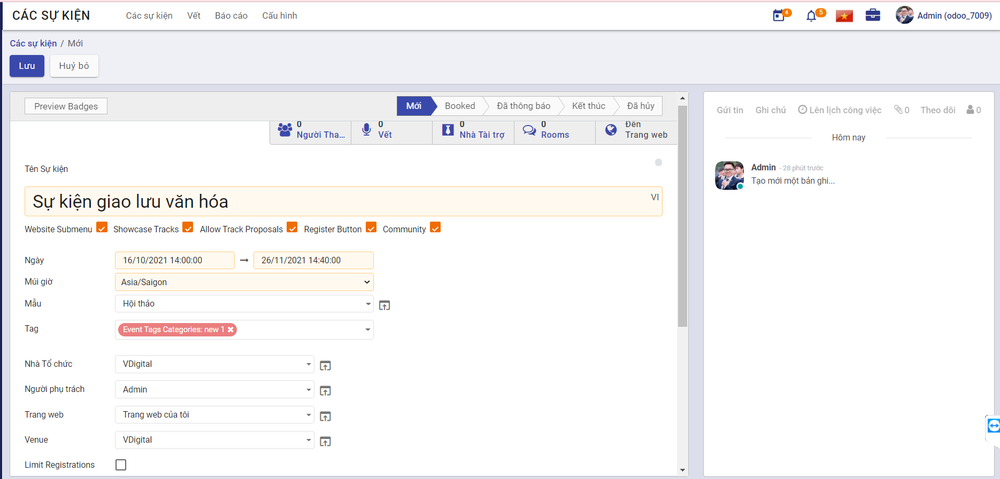
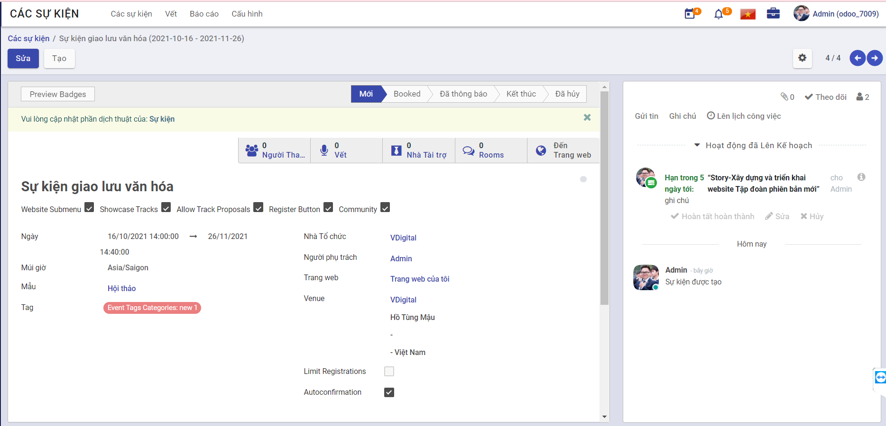
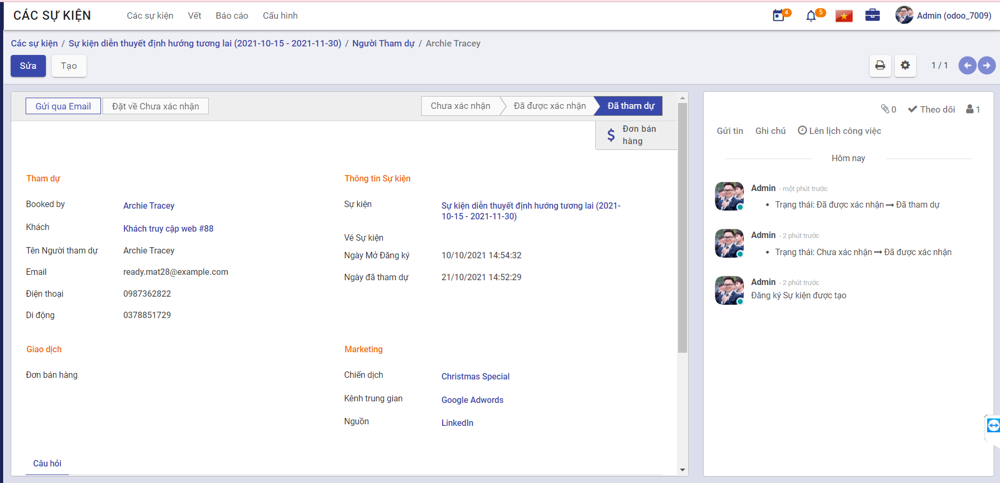
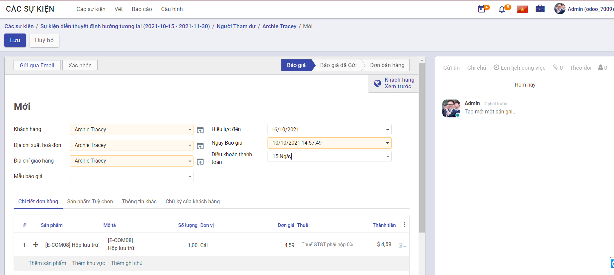
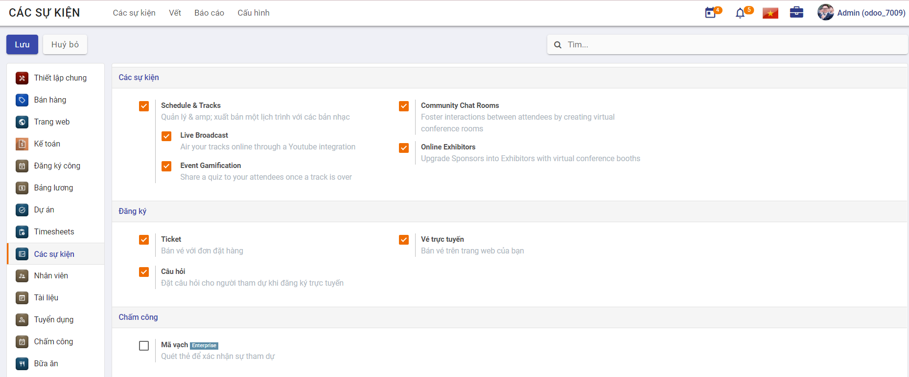

### Quy trình nghiệp vụ
Cho phép người dùng quản lý toàn bộ quy trình tổ chức sự kiện từ lập kế hoạch sự kiện, bán vé cho đến hiển thị trên trang web và quảng bá. Đồng thời cho phép quản lý lên danh sách người tham gia sự kiện.

#### Quy trình

**Các luồng quy trình**

* Sự kiện. Chi tiết nghiệp vụ <u>[tại đây](#su-kien)</u>.

* Báo cáo. Chi tiết nghiệp vụ <u>[tại đây](#bao-cao)</u>.

* Cấu hình. Chi tiết nghiệp vụ <u>[tại đây](#cau-hinh)</u>.

#### Mô tả nghiệp vụ

Khi người sử dụng muốn quản lý sự kiện thì quy trình thực hiện như sau:

1. Tại chức năng **Các sự kiện**, người dùng sẽ tạo sự kiện và phân loại sự kiện theo các giai đoạn

2. Các người dùng đăng ký tham gia sự kiện sau khi sự kiện được công khai trên trang web 

3. Thiết lập các thông tin diễn ra sự kiện và quản lý danh sách người tham gia 

4. Xuất báo cáo danh sách thông tin sự kiện để quản lý và theo dõi 

**Luồng chức năng chính**

* Quản lý sự kiện. Chi tiết nghiệp vụ <u>[tại đây](#quan-ly-su-kien)</u>.

* Quản lý người tham dự. Chi tiết nghiệp vụ <u>[tại đây](#quan-ly-nguoi-tham-du)</u>.

* Báo cáo. Chi tiết nghiệp vụ <u>[tại đây](#bao-cao)</u>.

* Thiết lập. Chi tiết nghiệp vụ <u>[tại đây](#thiet-lap)</u>.

**Video hướng dẫn**

### Sự kiện

#### Quản lý sự kiện

Người dùng quản lý thông tin của các sự kiện 

**Đối tượng thực hiện:** Người dùng hệ thống

1. Vào chức năng **Các sự kiện**, người sử dụng thực hiện phân loại sự kiện bằng cách di chuyển sự kiện tới giai đoạn tương ứng (Hoặc thực hiện **Tìm kiếm** trực tiếp chức năng trên ô tìm kiếm chung của hệ thống)

    * **Lưu ý:** Tại màn hình **Các sự kiện** có thể thêm giai đoạn bằng cách nhấn vào **Thêm một cột**. Ngoài ra các giai đoạn cũng có thể được được thêm tại **Cấu hình/Event Stages**

2. Thực hiện tạo **Các sự kiện**

3. Khai báo các thông tin chi tiết của Các sự kiện
   
    * Chọn thông tin Mẫu 
      
        * Danh sách mẫu sự kiện để lựa chọn sẽ được thêm tại **Cấu hình/Event Templates**
    
    * Chọn thông tin Tag 
      
        * Danh sách thẻ sự kiện để lựa chọn sẽ được thêm tại **Cấu hình/Event tags Categories**
        
    * Chọn thông tin Limit Registrations, người dùng khai báo thêm thông tin giới hạn số lượng Người Tham dự 
    
    * Khai báo thông tin chi tiết Ticket 
      
    * Khai báo thông tin chi tiết Thông tin giao dịch 
      
    * Khai báo thông tin chi tiết Ghi chú
    
4. Nhấn **Lưu** sự kiện 

5. Người dùng thực hiện **Theo dõi** sự kiện, **Thêm người theo dõi** hoặc **Thêm kênh theo dõi**. 

6. Người dùng tạo **Ghi chú** và **Gửi tin** đến người dùng cũng đang theo dõi sự kiện

7. Người dùng thực hiện **Lên lịch công việc** cho sự kiện

    * Khai báo các thông tin cần thiết
    
    * Nhấn **Ấn định thời gian** để thực hiện giao việc cho nhân sự được chọn 
    
    * Nhân sự hoàn thành công việc được giao sẽ đánh dấu công việc là **Hoàn tất hoàn thành**
    
    

8. Người dùng thực hiện thay đổi giai đoạn của sự kiện: Đang thực hiện, Sẵn sàng cho trạng thái kế tiếp hoặc Đã bị khóa
   
9. Người dùng nhấn **Vết** để quản lý các thông tin về các buổi thuyết trình trong quá trình diễn ra sự kiện và thông tin người diễn thuyết 

    * **Lưu ý**: Thông tin **Vết** được quản lý khi tại **Cấu hình/Thiết lập**, người dùng chọn thông tin Schedule & Tracks

10. Nhấn **Nhà tài trợ** để theo dõi và bổ sung danh sách nhà tài trợ cho sự kiện 

    * **Lưu ý**: Thông tin **Nhà tài trợ** được quản lý khi tại **Cấu hình/Thiết lập**, người dùng chọn thông tin Schedule & Tracks

11. Nhấn **Rooms** để quản lý danh sách và tạo phòng hội nghị ảo, để người tham dự sự kiện có thể trao đổi, tăng tương tác với nhau

    * **Lưu ý**: Thông tin **Rooms** được quản lý khi tại **Cấu hình/Thiết lập**, người dùng chọn thông tin Community Chat Rooms
    
12. Sau khi cập nhật hoàn chỉnh thông tin sự kiện, nhấn **Đến trang web** để thực hiện chuyển sự kiện thành công khai. Cho phép người dùng đăng ký tham dự sự kiện trực tuyến.

#### Quản lý người tham dự
Sau khi quản trị viên đăng tải sự kiện công khai, người dùng có thể tham dự sự kiện bằng các đăng ký trực tiếp trên website hoặc được thêm vào danh sách người tham dự bởi quản trị hệ thống. Quản trị hệ thống sẽ thống kê vào theo dõi danh sách người tham dự.

**Đối tượng thực hiện:** Người sử dụng hệ thống

1. Người dùng nhấn **Đến trang web** để xem thông tin sự kiện trên trang web. Tại **Website/Các sự kiện**, quản trị hệ thống chuyển sự kiện thành trạng thái công khai, cho phép người dùng khác có thể đăng ký tham dự sự kiện trên web bằng cách:

    * Người sử dụng hệ thống truy cập trang web, chọn **Các sự kiện**
    

    * Chọn sự kiện sẽ tham gia
    
    
    * Nhập đầy đủ thông tin của người tham dự, nhấn **Đăng ký** tham gia sự kiện
    
    
    * Nhấn **Tiếp tục** để đăng ký thành công
    
2. Sau khi người dùng thực hiện đăng ký tham dự sự kiện trên website thành công, quản trị hệ thống sẽ thực hiện quản lý danh sách người tham dự bằng cách: vào chức năng **Các sự kiện**, nhấn vào sự kiện để xem thông tin của sự kiện .Nhấn **Người tham dự** để xem và theo dõi danh sách người tham dự sự kiện. 

3. Tại **Người tham dự**, người dùng có thể thêm người tham dự sự kiện bằng cách nhấn **Tạo** để thêm một hoặc nhiều người tham dự khác
      
    * Khai báo các thông tin cần thiết
   
    * Trường hợp tại **Cấu hình/Thiết lập**, người dùng chọn thông tin Câu hỏi, sẽ phải khai báo thêm chi tiết thông tin Câu hỏi gồm: Câu hỏi, Loại câu hỏi, Câu trả lời được gợi ý và Câu trả lời dạng chữ 
   
    * Nhấn **Xác nhận** để tham gia sự kiện
   
    * Nhấn **Gửi qua Email** để gửi mail cảm ơn đến người tham dự 
   
    * Nhấn **Đã tham dự** để xác nhận người tham dự đã tham dự sự kiện
   
    * Nhấn **Đơn bán hàng** để tạo đơn hàng cho người tham dự 
     
        * Khai báo các thông tin cần thiết
       
        * Nhấn **Gửi qua Email** để gửi email báo giá đến người tham dự
       
        * Nhấn **Xác nhận** để xác nhận đơn hàng 
       
        * Đơn hàng được xác nhận sẽ được **Tạo hóa đơn**, khai báo các thông tin hóa đơn gồm: thông tin Tạo hóa đơn, Tổng tiền đặt cọc, Tài khoản doanh thu và Thuế bán hàng. Nhấn **Tạo và Xem hóa đơn** để thêm hóa đơn thành công
       

### Báo cáo

Người sử dụng thực hiện báo cáo danh sách **Các sự kiện** và danh sách **Người tham dự**

**Đối tượng thực hiện:** Người sử dụng hệ thống

1. Để thực hiện báo cáo thống kê danh sách các sự kiện, người dùng vào chức năng **Các sự kiện**, chọn **Báo cáo/Các sự kiện** (Hoặc thực hiện **Tìm kiếm** trực tiếp chức năng trên ô tìm kiếm chung của hệ thống)

2. Thực hiện vào chức năng **Các sự kiện**, chọn **Báo cáo/Người tham dự** để thống kế theo dõi danh sách người tham dự sự kiện (Hoặc thực hiện **Tìm kiếm** trực tiếp chức năng trên ô tìm kiếm chung của hệ thống)

3. Người dùng thực hiện thay đổi dữ liệu cần thống kê theo nhu cầu (nếu có)

    * Chọn **- Tổng** để loại bỏ điều kiện thống kê hiện tại theo hàng hoặc cột
    
    
    
    * Chọn **+ Tổng** để tạo mới điều kiện thống kê báo cáo theo hàng hoặc cột
    
    

4. Người dùng chọn **View graph** để xem báo cáo dưới dạng biểu đồ

5. Thực hiện **Xuất toàn bộ** danh sách thông tin các sự kiện

### Cấu hình

#### Thiết lập

Người sử dụng thực hiện **Thiết lập** thêm các thông tin cho sự kiện 

**Đối tượng thực hiện:** Người sử dụng là Quản trị hệ thống

1. Vào chức năng **Các sự kiện**, chọn **Cấu hình/Thiết lập** (Hoặc thực hiện **Tìm kiếm** trực tiếp chức năng trên ô tìm kiếm chung của hệ thống)

2. Khai báo thông tin chi tiết của Thiết lập 
    * Chọn thông tin Schedule & Tracks
   
        * Chọn thông tin Schedule & Tracks, khi tạo sự kiện người sử dụng sẽ quản lý thêm các thông tin Vết và Nhà tài trợ
        
        * Lưu ý người dùng sẽ khai báo thêm các thông tin:
        
            * Chọn thông tin Live Broadcast
            
            * Chọn thông tin Event Gamification
   
    * Chọn thông tin Community Chat Rooms
   
        * Chọn thông tin Community Chat Rooms, khi tạo sự kiện người sử dụng sẽ quản lý thêm thông tin Rooms
   
    * Chọn thông tin Online Exhibitors
   
    * Chọn thông tin Ticket
   
    *  Chọn thông tin Câu hỏi 
       
        * Chọn thông tin Câu hỏi, khi tạo sự kiện người sử dụng khai báo thêm thông tin Câu hỏi
   
    * Chọn thông tin Vé trực tuyến
   
    * Chọn thông tin Mã vạch 
   
3. Nhấn **Lưu** để lưu thông tin cấu hình

