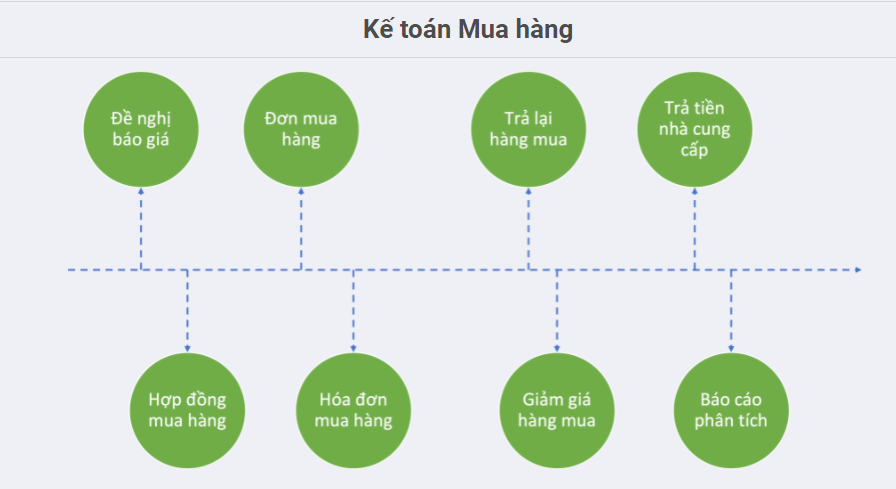
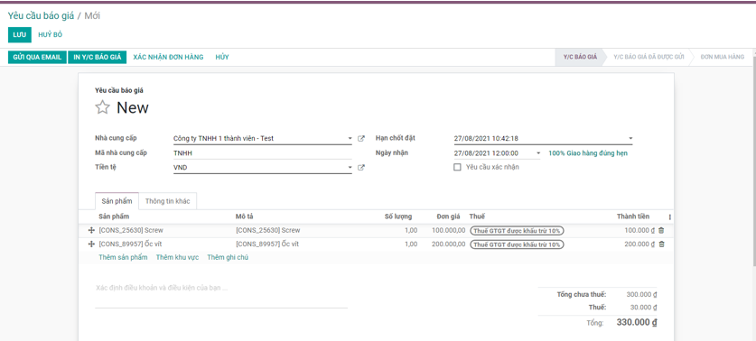
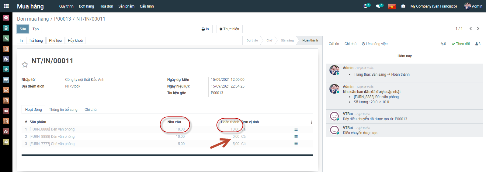
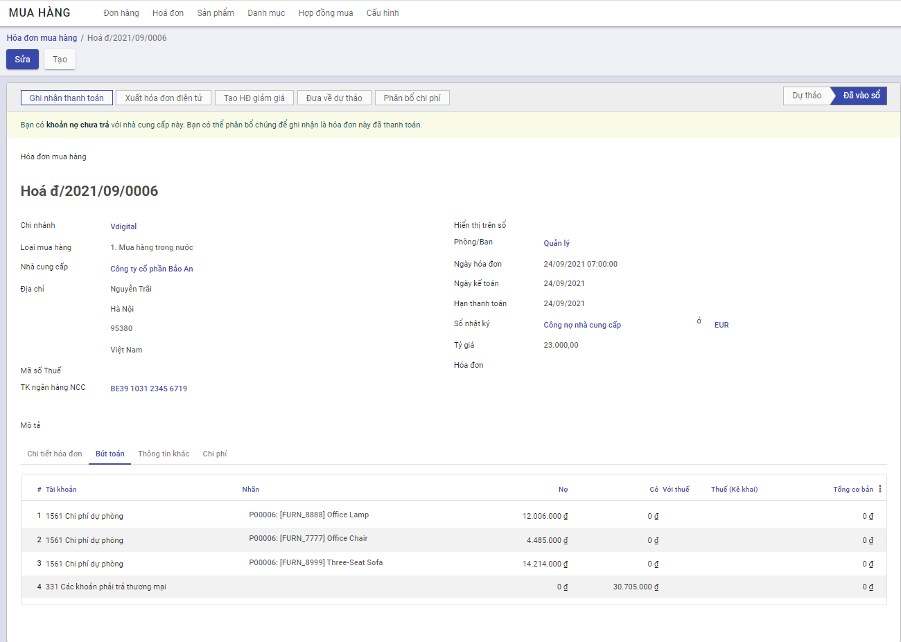
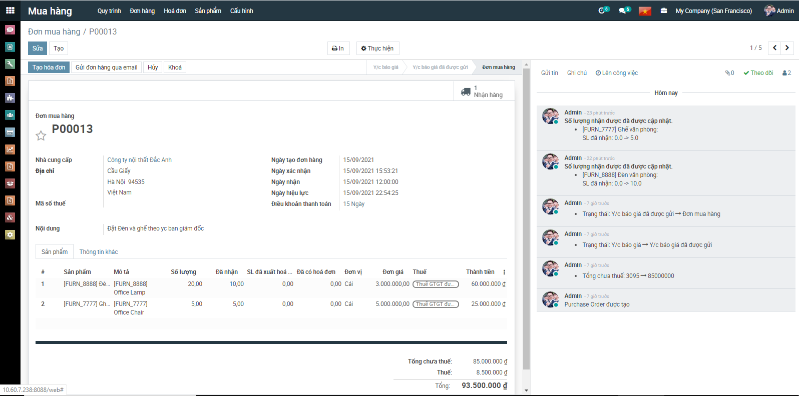

# **Quy trình nghiệp vụ**

Quản lý toàn bộ quy trình Mua hàng: Từ yêu cầu gửi báo giá đến Đơn hàng, Hóa đơn mua hàng và Hóa đơn trả hàng. Đồng thời theo dõi thanh toán hóa đơn và cấn trừ công nợ với nhà cung cấp, lên báo cáo mua hàng và báo cáo kế toán liên quan.

**Quy trình**

**Các luồng quy trình**

·     Lập yêu cầu báo giá gửi Nhà cung cấp. Chi tiết nghiệp vụ **[tại đây](#Lập yêu cầu báo giá gửi Nhà cung cấp)**

·     Lập Hợp đồng mua hàng. Chi tiết nghiệp vụ **[tại đây](#Lập Hợp đồng mua hàng)**

·     Lập Đơn mua hàng gửi Nhà cung cấp. Chi tiết nghiệp vụ [**tại đây**](#_Xác_nhận_Đơn)

·     Mua hàng trong nước về nhập kho. Chi tiết nghiệp vụ [**tại đây**](#_Mua_hàng_trong)

·     Mua hàng hóa nhập khẩu về nhập kho. Chi tiết nghiệp vụ [**tại đây**](#_Mua_hàng_hóa)

### **Yêu cầu báo giá**

#### **Mô tả nghiệp vụ**

Khi đơn vị có nhu cầu mua hàng, lập yêu cầu mua hàng thì quy trình thực hiện như sau:

1. Trưởng bộ phận có nhu cầu mua hàng trình Giám đốc đề nghị mua hàng kèm với đề xuất về nhà cung cấp (nếu có.

2. Ban giám đốc duyệt đề nghị mua hàng và chuyển lại cho bộ phận mua hàng; kế toán mua hàng.

3. Bộ phận mua hàng đàm phán giá cả với nhà cung cấp và đề xuất lựa chọn nhà cung cấp tới Ban giám đốc.

4. Kế toán mua hàng kiểm tra lại giá cả, thông tin nhà cung cấp để tư vấn thêm cho giám đốc về lựa chọn nhà cung cấp

5. Ban giám đốc phê duyệt về kế hoạch mua hàng

6. Bộ phận Mua hàng thực hiện Lập yêu cầu báo giá và gửi thông tin đến Nhà cung cấp

**Luồng chức năng chính**

·     Lập yêu cầu báo giá gửi Nhà cung cấp. Chi tiết nghiệp vụ **[tại đây](#Lập yêu cầu báo giá gửi Nhà cung cấp)**

·     Xác nhận Đơn hàng từ Nhà cung cấp. Chi tiết nghiệp vụ [**tại đây**](#Xác nhận Đơn hàng từ Nhà cung cấp)

**Xem video hướng dẫn**

*[Xây dựng video hướng dẫn trên phần mềm, gồm đủ các luồng chức năng được mô tả bên dưới]*

#### **Lập yêu cầu báo giá gửi Nhà cung cấp**

**Lập yêu cầu báo giá**

·     Khi Ban GĐ/Quản lý phê duyệt kế hoạch mua hàng; bộ phận mua hàng thực hiện lập Yêu cầu báo giá gửi cho Nhà cung cấp. Theo dõi phản hồi của nhà cung cấp về yêu cầu báo giá.

**Đối tượng thực hiện :** Nhân viên bộ phận mua hàng 

1. Vào phân hệ **Mua hàng**, Chọn **Yêu cầu báo giá** (Hoặc thực hiện **Tìm kiếm** trực tiếp chức năng trên ô tìm kiếm chung của hệ thống)

    

2. Khai báo các thông tin chi tiết của **Yêu cầu báo giá:**

    ·     Chọn thông tin Nhà cung cấp

    ·     Chọn tiền tệ giao dịch trong Đơn hàng

    ·     Khai báo thông tin về Hạn chốt, Ngày nhận

    ·     Khai báo thông tin về Sản phẩm đặt từ Nhà Cung cấp: 

    1. Chọn các sản phẩm yêu cầu báo giá từ nhà cung cấp
    2. Nhập thông tin Số lượng, Đơn giá, Chiết khấu và mức Thuế đối với từng Sản phẩm
    3. Với nội dung cần Lưu ý đối với Yêu cầu báo giá, thực hiện Thêm ghi chú è Thông tin nội dung sẽ được in trên file gửi nhà Cung cấp

3. Nhấn **Lưu**

4. Thực hiện In yêu cầu báo giá: kiểm tra thông tin dữ liệu trên mẫu yêu cầu báo giá và tùy chỉnh thông tin Mẫu yêu cầu

5. Thực hiện Gửi Email đến nhà cung cấp sau khi hoàn thành Yêu cầu báo giá

#### **Xác nhận Đơn hàng từ Nhà cung cấp**

**Xác nhận Đơn hàng**

·     Các đơn hàng được Nhà cung cấp trả hàng theo Yêu cầu báo giá đã gửi, bộ phận mua hàng/kho thực hiện xác nhận về kho của công ty

**Đối tượng thực hiện :** Nhân viên bộ phận mua hàng

1. Vào phân hệ **Mua hàng**, trên **Danh sách Yêu cầu báo giá**, tìm thông tin Yêu cầu đã được Nhà cung cấp xác nhận và thực hiện trả 

2. Thực hiện xác nhận thông tin Số lượng sản phẩm mà Nhà cung cấp bàn giao

   ·     Trường hợp Nhà cung cấp trả hàng theo đúng Yêu cầu báo giá: Thực hiện Xác nhận thông tin toàn bộ Đơn hàng mà không cần xác nhận từng Sản phẩm nhận được

   ·     Trường hợp Nhà cung cấp trả hàng còn thiếu/thừa so với Yêu cầu: Khi đó người dùng cần Vào từng sản phẩm để xác nhận theo đúng số lượng thực tế nhận về

3.  Nhấn nút **Xác nhận**

**<u>Lưu ý:</u>**

1. Sau khi thực hiện Xác nhận đơn hàng, chương trình tự động tạo ra một Phiếu nhập kho bên Phân hệ Quản lý kho
2. Yêu cầu báo giá được thực hiện Xác nhận đơn hàng: Sẽ không được hiển thị trên Danh sách Yêu cầu báo giá.

### **Hợp đồng mua hàng**

#### **Mô tả nghiệp vụ**

Hợp đồng mua hàng được thực hiện sau luồng Yêu cầu báo giá gửi nhà cung cấp được hoàn thành:

1. Ban giám đốc phê duyệt về kế hoạch mua hàng; phê duyệt Nhà cung cấp mua hàng cùng với Hàng hóa, số lượng, đơn giá cho đợt mua
2. Bộ phận mua hàng thực hiện Lập hợp đồng mua hàng theo Đơn mua đã gửi và đã được phê duyệt theo các điều khoản về Giá, chiết khấu của các mặt hàng đã thỏa thuận với bên Nhà cung cấ
3. Nhà cung cấp thực hiện cung cấp hàng hóa, dịch vụ cho đơn vị theo các điều khoản trên hợp đồng. Bộ phận mua hàng chuyển lại hợp đồng cho kế toán theo dõi, đồng thời làm các đề nghị thanh toán để thanh toán tiền hàng cho nhà cung cấp.
4. Kế toán làm thủ tục nhập hàng, đồng thời theo dõi tình hình cung cấp hàng theo hợp đồng, tình hình thanh toán tiền và nhận các hóa đơn mua vào. Từ đó lập các báo cáo liên quan như Báo cáo tình hình thực hiện và công nợ hợp đồng.
5. Bộ phận mua hàng lập phụ lục hợp đồng xin phê duyệt bổ sung theo các trình tự trên nếu có phát sinh các yêu cầu khác với hợp đồng chính và trong thời gian hợp đồng chính còn hiệu lực.
6. Sau khi hai bên đã hoàn tất nghĩa vụ hợp đồng, bộ phận mua hàng lập thanh lý hợp đồng để bên mua và bên bán ký

**Luồng chức năng chính**

·     Lập Hợp đồng mua hàng. Chi tiết nghiệp vụ **[tại đây](#Đơn mua hàng từ yêu cầu báo giá)**

·     Quản lý Hợp đồng mua. Chi tiết nghiệp vụ [**tại đây**](#Đơn mua hàng từ Lệnh sản xuất)

**Xem video hướng dẫn**

*[Xây dựng video hướng dẫn trên phần mềm, gồm đủ các luồng chức năng được mô tả bên dưới]*

#### **Lập Hợp đồng mua hàng**

**Hợp đồng mua hàng**

·     Hợp đồng mua hàng được lập để theo dõi tình hình cung cấp hàng, tình hình thanh toán cho Nhà cung cấp

**Đối tượng thực hiện :** Nhân viên bộ phận mua hàng và Kế toán thanh toán

1. Vào phân hệ **Mua hàng**, Chọn **Hợp đồng mua hàng** (Hoặc thực hiện **Tìm kiếm** trực tiếp chức năng trên ô tìm kiếm chung của hệ thống)

2. Tại phần **Thông tin chung** của Hợp đồng

- Mục **Nhà cung cấp**: Chọn thông tin Nhà cung cấp và Tiền tệ trong giao dịch mua hàng cùng với các điều khoản về Ngày ký, Đơn vị thực hiện

- Mục **Giá trị hợp đồng**: Tự khai báo hoặc chương trình sẽ tự động lấy lên theo Tổng tiền thanh toán của các mặt hàng tại mục **Danh sách hàng hóa**.

  **Lưu ý:**

  - *Với các hợp đồng đã được thanh lý (có trạng thái **Đã thanh lý**), nếu giá trị khi thanh lý khác với giá trị của hợp đồng, Kế toán sẽ thực hiện sửa hợp đồng mua để cập nhật lại **Giá trị thanh lý**.*
  - *Tích chọn **Là hợp hợp đồng phát sinh trước khi sử dụng phần mềm**, nếu vẫn có nhu cầu quản lý các hợp đồng này. => Khi đó, Kế toán sẽ khai báo thêm thông tin về **Giá trị đã thực hiện** và **Số đã trả**.* 

- Mục **Danh sách hàng hóa**: Khai báo thông tin chi tiết của hàng hóa, dịch vụ mua

3. Nhấn **Lưu**

**Lưu ý:**

- Để nhập nhanh Hợp đồng: Kế toán thực hiện chọn **Đơn đặt hàng**: Khi đó thông tin về Nhà cung cấp và Danh sách hàng hóa được lấy mặc định theo Đơn đặt hàng

#### **Quản lý hợp đồng mua**

**Quản lý Hợp đồng mua hàng**

·     Kế toán theo dõi và cập nhật thông tin Trạng thái của Hợp đồng, đồng thời theo dõi tình hình cung cấp hàng theo hợp đồng, tình hình thanh toán tiền và nhận các hóa đơn mua vào

**Đối tượng thực hiện :** Kế toán thanh toán

1. Vào phân hệ **Mua hàng**, Chọn **Hợp đồng mua hàng** (Hoặc thực hiện **Tìm kiếm** trực tiếp chức năng trên ô tìm kiếm chung của hệ thống)

2. Tại phần Xem thông tin của Hợp đồng

- Thực hiện cập nhật trạng thái thực của Hợp đồng theo từng đơn hàng: Chưa thực hiện, Đang thực hiện, Thanh lý hoặc Huỷ bỏ
- Theo dõi các thông tin về Tổng thu/Tổng chi tương ứng của Hợp đồng; Xem chi tiết theo từng giao dịch

### **Đơn mua hàng**

#### **Mô tả nghiệp vụ**

Đơn mua hàng được thực hiện sau luồng Yêu cầu báo giá gửi nhà cung cấp được hoàn thành:

1. Ban giám đốc phê duyệt về kế hoạch mua hàng
2. Bộ phận Mua hàng thực hiện Lập yêu cầu báo giá và gửi thông tin đến Nhà cung cấp
3. Sau khi lựa chọn và chốt giá cả với Nhà cung cấp được lựa chọn: Bộ phận mua hàng thực hiện lập đơn mua hàng theo thỏa thuận với nhà cung cấp để chốt lại hàng hóa, số lượng, giá cả, hạn thanh toán, hạn giao hàng, địa điểm giao hàng....
4. Bộ phận mua hàng chuyển Giám đốc ký duyệt và chuyển lại đơn mua hàng cho nhà cung cấp để nhà cung cấp kiểm tra, ký đơn mua hàng, chuyển lại cho bộ phận mua hàng lưu trữ chứng từ.
5. Đơn mua hàng có thể được lập mới từ đầu hoặc được lập từ: Yêu cầu báo giá và Lệnh sản xuất

**Luồng chức năng chính**

·     Đơn mua hàng từ Yêu cầu báo giá. Chi tiết nghiệp vụ **[tại đây](#Đơn mua hàng từ yêu cầu báo giá)**

·     Đơn mua hàng từ Lệnh sản xuất. Chi tiết nghiệp vụ [**tại đây**](#Đơn mua hàng từ Lệnh sản xuất)

**Xem video hướng dẫn**

*[Xây dựng video hướng dẫn trên phần mềm, gồm đủ các luồng chức năng được mô tả bên dưới]*

#### **Đơn mua hàng từ yêu cầu báo giá**

**Đơn mua hàng**

·     Được thực hiện sau khi lựa chọn giá cả và Nhà cung cấp đã được Phê duyệt.

·     Bộ phận mua hàng thực hiện lập đơn mua hàng theo thỏa thuận với nhà cung cấp để chốt lại hàng hóa, số lượng, giá cả, hạn thanh toán, hạn giao hàng, địa điểm giao hàng

·     Nhà cung cấp chuyển hàng theo Đơn mua hàng của Doanh nghiệp, có thể chuyển 1 lần hoặc nhiều lần cho một Đơn hàng

**Đối tượng thực hiện :** Nhân viên bộ phận mua hàng 

1. Vào phân hệ **Mua hàng**, Chọn **Đơn mua hàng** (Hoặc thực hiện **Tìm kiếm** trực tiếp chức năng trên ô tìm kiếm chung của hệ thống)

2. Trên Danh sách Đơn mua hàng: Hiển thị các Yêu cầu báo giá được Nhà cung cấp phản hồi và bộ phận Mua hàng đã thực hiện Xác nhận đơn hàng

- Tại Đơn mua hàng: 
  - Nhân viên phụ trách có thể thực hiện sửa thông tin về Ngày nhận hay Thông tin về sản phẩm
  - Mục Điều khoản thanh toán: Nếu có thỏa thuận về điều kiện thanh toán với nhà cung cấp thực hiện chọn thông tin Điều khoản đã được khai báo trên Danh mục **Điều khoản thanh toán** . Trường hợp đã thiết lập điều khoản thanh toán cho từng nhà cung cấp tại danh mục **Nhà cung cấp** thì chương trình sẽ tự động hiển thị sẵn thông tin này theo nhà cung cấp được chọn

3. Nhà cung cấp thực hiện giao hàng, hàng về đến công ty, phân xưởng sản xuất, công trường, kế toán mua hàng nhận hàng và bàn giao bàn giao cho bộ phận sử dụng

- Nhấn **Nhận hàng** khi Nhà cung cấp thực hiện bàn giao hàng theo Đơn hàng

  

- Thực hiện xác nhận hàng được giao theo Số lượng bàn giao thực tế của Nhà cung cấp

  - Nếu Số lượng bàn giao đủ theo Số lượng của Đơn mua hàng: Thực hiện nhấn **Xác nhận** để xác nhận toàn bộ Đơn hàng
  - Nếu Số lượng bàn giao Chưa đủ theo Số lượng của Đơn mua hàng: Thực hiện nhập số lượng theo thực tế.

  

- Nhấn **Xác nhận** Số lượng đã nhập từ Nhà cung cấp: Hệ thống tạo ra Phiếu nhập kho tương ứng với Đơn hàng đã nhận về

#### **Đơn mua hàng từ Lệnh sản xuất**

**Đơn mua hàng**

Khi có yêu cầu xuất kho vật tư hàng hóa để lắp ráp thành thành phẩm, thông thường sẽ phát sinh các hoạt động sau

·     Căn cứ vào đơn hàng của khách hàng, trưởng bộ phận bán hàng hoặc bộ phận kho lập lệnh sản xuất

·     Căn cứ vào lệnh sản xuất Kế toán kho hoặc người chịu trách nhiệm sẽ viết phiếu xuất kho linh kiện mang đi lắp ráp

·     Trường hợp Kho hàng không đáp ứng đủ linh kiện đưa vào sản xuất: Bộ phân mua hàng thực hiện trình Kế toán trưởng và Giám đốc ký duyệt để thực hiện mua hàng

·     Ban giám đốc phê duyệt về kế hoạch mua linh kiện sản xuất

·     Bộ phận mua hàng thực hiện lập Đơn mua hàng từ Lệnh sản xuất đã được phê duyệt

**Đối tượng thực hiện :** Nhân viên bộ phận mua hàng 

1. Vào phân hệ **Mua hàng**, Chọn **Đơn mua hàng** và Nhấn **Tạo** (Hoặc thực hiện **Tìm kiếm** trực tiếp chức năng trên ô tìm kiếm chung của hệ thống)

2. Thực hiện chọn Lệnh sản xuất cần mua hàng từ Nhà cung cấp

- Sau khi Lệnh sản xuất được chọn: Thông tin Sản phẩm trên Danh sách Đơn mua hàng được lấy theo Danh sách của Lệnh sản xuất
- Tại Đơn mua hàng: Nhân viên phụ trách có thể thực hiện sửa thông tin về Ngày nhận hay Thông tin về sản phẩm

3. Nhà cung cấp thực hiện giao hàng, hàng về đến công ty, phân xưởng sản xuất, công trường, kế toán mua hàng nhận hàng và bàn giao bàn giao cho bộ phận sử dụng

- Nhấn **Nhận hàng** hoặc **Nhận sản phẩm** khi Nhà cung cấp thực hiện bàn giao hàng theo Đơn hàng

  

- Thực hiện xác nhận hàng được giao theo Số lượng bàn giao thực tế của Nhà cung cấp

  - Nếu Số lượng bàn giao đủ theo Số lượng của Đơn mua hàng: Thực hiện nhấn **Xác nhận** toàn bộ Đơn hàng
  - Nếu Số lượng bàn giao Chưa đủ theo Số lượng của Đơn mua hàng: Thực hiện nhập số lượng theo thực tế. Khi đó có 2 hướng thực hiện cho Đơn hàng không giao nhận đủ Số lượng theo đơn đặt: 
    - Nếu chọn **Tạo phần dở dang**: Với Số lượng Đơn hàng còn thiếu, chương trình tạo sẵn 1 chứng từ Nhận hàng, để Khi Nhà cung cấp hoàn thành bàn giao lần 2 với Số lượng còn lại, bộ phận mua hàng tiếp tục vào Đơn hàng để thực hiện Xác nhận Số lượng bàn giao còn lại
    - Nếu chọn **Không tạo phần dở dang**:  Khi đó hệ thống Tách Số lượng trên Đơn hàng ban đầu Bằng đúng Số lượng thực nhận, còn Số lượng chênh chưa nhận được bàn giao giao nhận Số lượng hoàn thành = 0

  

  

- Nhấn **Xác nhận** Số lượng đã nhập từ Nhà cung cấp: Hệ thống tạo ra Phiếu nhập kho tương ứng với Đơn hàng đã nhận về

### **Hóa đơn mua hàng**

#### **Mô tả nghiệp vụ**

Đơn mua hàng được thực hiện sau luồng Yêu cầu báo giá gửi nhà cung cấp được hoàn thành:

1. Nhà cung cấp thực hiện giao hàng, hàng về đến công ty, phân xưởng sản xuất, công trường, kế toán mua hàng nhận hàng và bàn giao cho bộ phận sử dụng
2. Nhân viên mua hàng giao cho kế toán mua hàng hóa đơn chứng từ của nhà cung cấp.
3. Kế toán mua hàng hạch toán chi phí và kê khai hóa đơn đầu vào.
4. Trường hợp nhân viên mua hàng thanh toán ngay (bằng tiền mặt hoặc chuyển khoản) cho nhà cung cấp sau khi nhận được hàng, khi về đến doanh nghiệp sẽ thực hiện các thủ tục để thanh toán với Kế toán
5. Trường hợp còn nợ nhà cung cấp, sau khi nhận được chứng từ của nhân viên mua hàng, kế toán mua hàng hạch toán công nợ với nhà cung cấp

**Luồng chức năng chính**

·     Tạo hóa đơn từ Đơn mua hàng. Chi tiết nghiệp vụ **[tại đây](#Tạo hóa đơn từ Đơn mua hàng)**

·     Đơn mua hàng từ Lệnh sản xuất. Chi tiết nghiệp vụ [**tại đây**](#Đơn mua hàng từ Lệnh sản xuất)

#### **Tạo hóa đơn từ Đơn mua hàng**

**Tạo hóa đơn**

·     Sau khi hàng hóa được nhận từ Nhà cung cấp, Kế toán mua hàng căn cứ vào hóa đơn chứng từ của Nhà cung cấp để thực hiện Tạo hóa đơn mua hàng

**Đối tượng thực hiện :** Nhân viên kế toán

1. Vào phân hệ **Mua hàng**, Chọn **Hóa đơn mua hàng** đã hoàn thành Nhận hàng từ Nhà cung cấp và Nhấn **Tạo hóa đơn** (Hoặc thực hiện **Tìm kiếm** trực tiếp chức năng trên ô tìm kiếm chung của hệ thống)

   

2. Trên thông tin Hóa đơn mua hàng, Nhân viên kế toán thực hiện nhập các dữ liệu về:
   - Hóa đơn: Ngày hóa đơn, Mẫu số, Ký hiệu hóa đơn và Số hóa đơn
   -  Tài khoản ngân hàng người nhận: Thông tin Tài khoản được lấy theo giá trị thiết lập khi khai báo thông tin tai Danh mục Nhà cung cấp
   - Chọn và nhập thông tin về Thuế và Chiết khấu tương ứng của Đơn hàng

3. Thông tin dữ liệu hạch toán:

   - Căn cứ thông tin Thuế đầu vào đã lựa chọn cùng với thông tin Chiết khấu, Đơn giá, Số lượng của Đơn hàng, hệ thống thực hiện mặc định thông tin các bút toán tương ứng

   *[Bổ sung hình ảnh]*

4. Nhân viên Kế toán thực hiện nhấn Xác nhận 

#### **Thanh toán cho Nhà cung cấp**

**Ghi nhận thanh toán**

·     Sau khi thực hiện Nhận hàng từ Nhà cung cấp, đơn vị thực hiện kiểm tra thông tin đơn hàng và tiến hành Thanh toán cho Nhà cung cấp.

·     Việc thanh toán có thể ghi nhận thực hiện nhiều lần.

**Đối tượng thực hiện :** Nhân viên kế toán

1. Vào phân hệ **Mua hàng**, Chọn **Hóa đơn mua hàng** đã hoàn thành **Vào sổ** và Nhấn **Ghi nhận thanh toán** (Hoặc thực hiện **Tìm kiếm** trực tiếp chức năng trên ô tìm kiếm chung của hệ thống)

2. Tại màn hình **Ghi nhận thanh toán** kế toán thanh toán thực hiện:

- Chọn Phương thức thanh toán, nếu thanh toán chuyển khoản thì thông tin Tài khoản được hiển thị mặc định theo Tài khoản của Nhà cung cấp đã được khai báo tại Danh mục **Nhà cung cấp**

- Nhập thông tin về Số tiền thanh toán, Ngày thanh toán của hóa đơn cho Đơn hàng

  *[Hình]*

3. Nhấn **Lưu**

#### **Phân bổ chi phí**

**Phân bổ chi phí**

·     Với các Đơn hàng có phát sinh chi phí dịch vụ, sau khi đã xác nhận hàng và hóa đơn của Nhà cung cấp, kế toán thực hiện Phân bổ chi phí cho các Phí dịch vụ trong quá trình Mua hàng

**Đối tượng thực hiện :** Nhân viên kế toán

1. Vào phân hệ **Mua hàng**, Chọn **Đơn mua hàng** đã hoàn thành Nhận hàng từ Nhà cung cấp và Nhấn **Tạo hóa đơn** (Hoặc thực hiện **Tìm kiếm** trực tiếp chức năng trên ô tìm kiếm chung của hệ thống)
2. Nhân viên kế toán khai báo thông tin Chi phí dịch vụ cho Đơn mua hàng và thực hiện phân bổ các Chi phí dịch vụ phát sinh

### **Hóa đơn giảm giá/trả lại hàng mua**

#### **Mô tả nghiệp vụ**

Khi phát hiện hàng mua về không đúng quy cách, chất lượng như đã thỏa thuận ban đầu.... thì đơn vị thực hiện trả lại hàng:

1. Đơn vị và nhà cung cấp sẽ thỏa thuận với nhau và lập biên bản về việc trả lại hàng.
2. Sau khi thống nhất với Nhà cung cấp, Nhân viên kế toán thực hiện Luồng trả hàng Ngay tại Đơn mua hàng tương ứng
3. Thông tin Kho hàng và Hóa đơn trả hàng sẽ được tạo tại thời điểm thực hiện Trả hàng

**Luồng chức năng chính**

·     Tạo hóa đơn giảm giá/trả lại hàng. Chi tiết nghiệp vụ **[tại đây](#Tạo hóa đơn từ Đơn mua hàng)**

·     Đơn mua hàng từ Lệnh sản xuất. Chi tiết nghiệp vụ [**tại đây**](#Đơn mua hàng từ Lệnh sản xuất)

#### **Tạo hóa đơn giảm giá/trả lại hàng**

**Tạo hóa đơn**

·     Sau khi hoàn thành việc thỏa thuận với Nhà cung cấp về các mặt hàng không đảm bảo, kế toán thực hiện Lập Hóa đơn giảm giá/trả lại hàng cho Nhà cung cấp

**Đối tượng thực hiện :** Nhân viên kế toán

1. Vào phân hệ **Mua hàng**, Chọn **Đơn mua hàng** đã hoàn thành Nhận hàng từ Nhà cung cấp và Nhấn **Tạo hóa đơn** (Hoặc thực hiện **Tìm kiếm** trực tiếp chức năng trên ô tìm kiếm chung của hệ thống)

   

2. Trên thông tin Hóa đơn mua hàng, Nhân viên kế toán thực hiện nhập các dữ liệu về:

   - Hóa đơn: Ngày hóa đơn, Mẫu số, Ký hiệu hóa đơn và Số hóa đơn
   - Tài khoản ngân hàng người nhận: Thông tin Tài khoản được lấy theo giá trị thiết lập khi khai báo thông tin tai Danh mục Nhà cung cấp
   - Chọn và nhập thông tin về Thuế và Chiết khấu tương ứng của Đơn hàng

3. Thông tin dữ liệu hạch toán:

   - Căn cứ thông tin Thuế đầu vào đã lựa chọn cùng với thông tin Chiết khấu, Đơn giá, Số lượng của Đơn hàng, hệ thống thực hiện mặc định thông tin các bút toán tương ứng

   *[Bổ sung hình ảnh]*

4. Nhân viên Kế toán thực hiện nhấn Xác nhận 
