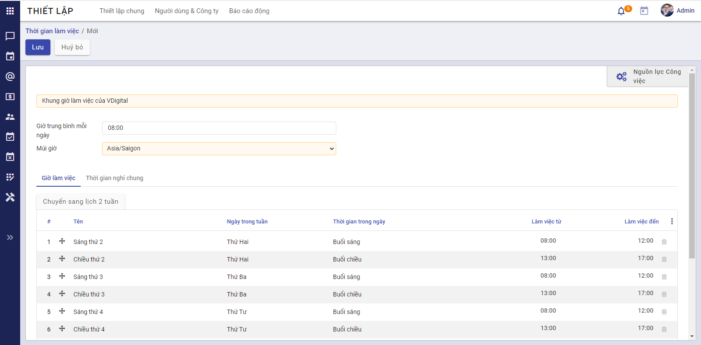
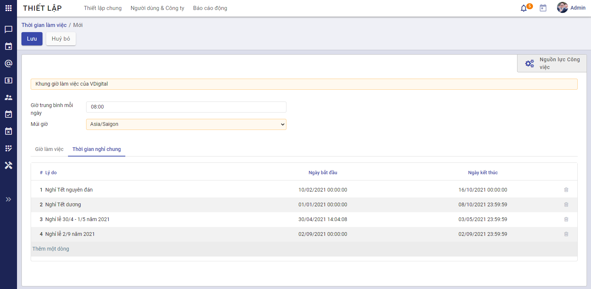
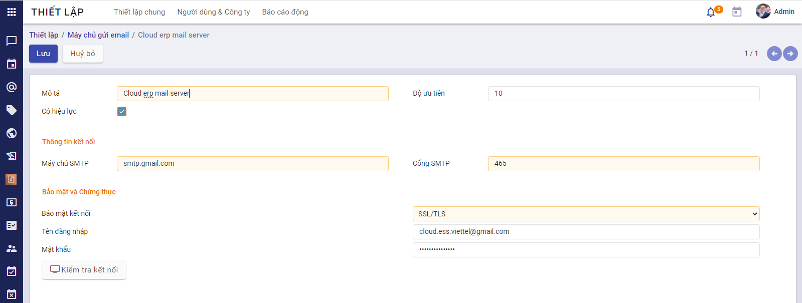
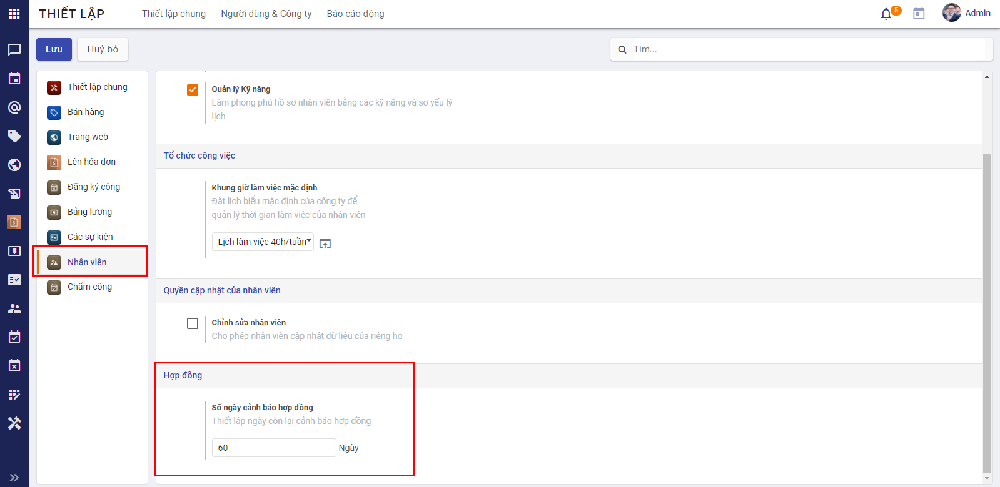
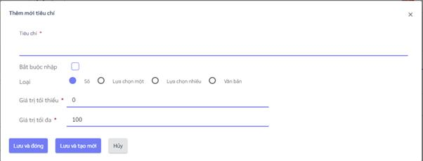
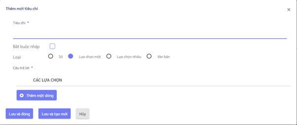

# Hướng dẫn thiết lập và khai báo dữ liệu ban đầu

## Mô tả nghiệp vụ

**Quy trình nghiệp vụ**

- Khách hàng có nhu cầu sử dụng nền tảng vESS, sau khi thực hiện mua tên miền và tài khoản Quản trị viên thành công, khách hàng sẽ được cung cấp một tên miền và tên đăng nhập vào hệ thống
- Khởi tạo ban đầu, khách hàng cần thêm các thông tin về Công ty của mình.
- Sau khi có đầy đủ thông tin về Công ty, khách hàng thực hiện tạo cơ cấu tổ chức, thiết lập cơ cấu phòng ban, bộ phận trong đơn vị, và một số thông tin khác phục vụ cho công tác thống kê và quản lý nhân viên

**Luồng quy trình**

- Luồng mua tên miền và đăng ký tài khoản Quản trị viên. Chi tiết [tại đây](https://ess-system-guide.readthedocs.io/en/latest/saas/saas/)
- Luồng khởi tạo thông tin Công ty. Chi tiết [tại đây](#Công ty)
- Luồng khởi tạo cơ cấu tổ chức. Chi tiết [tại đây](#Đơn vị, phòng ban).
- Luồng thiết lập khai báo ban đầu. Chi tiết [tại đây](#Thiết lập các thông tin ban đầu)

## Hướng dẫn khai báo

### Công ty

**Đối tượng thực hiện:** Quản trị viên ứng dụng

**Các bước thực hiện**

**Bước 1:** Sau khi thực hiện mua tên miền và tài khoản Quản trị viên thành công, khách hàng sẽ được cung cấp một tên miền và tên đăng nhập vào hệ thống.

**Bước 2:** Người dùng truy cập vào phân hệ **Thiết lập>Người dùng và Công ty>Công ty**, tại đây hiển thị tên Công ty mà người dùng đã khai báo khi mua tên miền, không cho phép người dùng **Thêm mới** bất cứ công ty nào, chỉ cho phép **Sửa** thông tin công ty đã đăng ký.

**Bước 3:** Khai báo các **Thông tin chung**, cập nhật **Giới thiệu**, **Logo** công ty theo mong muốn khách hàng và thực hiện **Lưu** lại.

### Đơn vị, phòng ban

**Đối tượng thực hiện:** Quản trị viên

Thiết lập cơ cấu phòng ban, bộ phận trong đơn vị, phục vụ cho công tác thống kê và quản lý nhân viên.

#### **Khai báo cây đơn vị cho đơn vị không có chi nhánh**

Với đơn vị không có chi nhánh, cơ cấu tổ chức của đơn vị được phân ra làm các cấp như sau:

- Cấp thứ nhất: Sau khi đăng ký thành công thì hệ thống tự động tạo tạo một mức cao nhất là mức độ **Công ty**  cấp tổ chức này được thiết lập dựa trên thông tin công ty đã được đăng ký.
- Cấp thứ hai: Cấp tổ chức này là con của cấp tổ chức thứ nhất.
- Cấp thứ n: Cấp tổ chức này là con của cấp tổ chức thứ (n-1)

**Lưu ý**: Nên khai báo đầy đủ cơ cấu tổ chức của đơn vị đến cấp chi tiết nhất để phục vụ cho công tác hạch toán kế toán sau này.

**Các bước thực hiện**

**Bước 1: **Vào phân hệ **Nhân viên**>**Cấu hình**>**Phòng/Ban**.

**Bước 2:** Chọn **Tạo**

**Bước 3:** Khai báo thông tin cơ cấu tổ chức

Tại mục **Cấp độ phòng ban**: chọn mức Phòng ban 

Tại mục **Chi nhánh:** Khi chọn mức Phòng ban ở mục trên, người dùng chọn dữ liệu trong thanh thao tác. Ở đây hệ thống tự động gán dữ liệu mục này chính là tên công ty mà và là mức cao nhất.

Tại mục **Người quản lý:** Chọn người quản lý của phòng ban này.

Tại mục **Phòng/Ban cấp trên:** Chọn cơ cấu tổ chức cấp cha (nếu có)

**Bước 4:** Chọn **Lưu**

#### Khai báo cây đơn vị cho đơn vị có chi nhánh

- Cấp thứ nhất: **Tổng công ty**: Cấp tổ chức này sẽ được chương trình tự động sinh ra ngay sau khi đăng ký thành công. 

- Cấp thứ hai: **Công ty con/Chi nhánh/Văn phòng đại diện/Văn phòng**: Cấp tổ chức này thuộc cấp tổ chức thứ nhất

- Cấp thứ ba: **Trung tâm/Phòng ban/Nhóm**: Cấp tổ chức này có thể thuộc cấp tổ chức thứ nhất hoặc thứ hai.

**Lưu ý**: Nên khai báo đầy đủ cơ cấu tổ chức của đơn vị đến cấp chi tiết nhất để phục vụ cho công tác hạch toán kế toán sau này.

**Các bước thực hiện**

**Bước 1: **Vào phân hệ **Nhân viên**>**Cấu hình**>**Phòng/Ban**.

**Bước 2:** Chọn **Tạo**

**Bước 3:** Khai báo thông tin cơ cấu tổ chức

- Tại mục **Cấp độ phòng ban:** Khai báo cơ cấu tổ chức cho đơn vị khai báo 

- Tại mục **Chi nhánh:** Chọn cơ cấu tổ chức cấp cha.

- Tại mục **Phòng/Ban cấp trên:** Chọn cơ cấu tổ chức cấp cha, có thể chọn hoặc không.

**Bước 4:** Chọn **Lưu**

### Thiết lập các thông tin ban đầu

Tại đây hướng dẫn các thiết lập chung ban đầu để sử dụng phân hệ Nhân sự và các phân hệ liên quan như Chấm công, Đăng ký công

#### Lịch làm việc

- Mục đích: Thiết lập các lịch làm việc cho công ty

Mỗi công ty có thể có 1 lịch làm việc chung cho tất cả nhân viên, hoặc nhiều lịch làm việc cho từng bộ phận nhân viên khác nhau. Tại đây, người quản trị hệ thống thực hiện thiết lập các lịch làm việc ban đầu cho công ty bằng cách: Vào menu **Thiết lập** >> Chọn **Người dùng & Công ty** >> **Thời gian làm việc** >> Bấm nút **Tạo**, hệ thống hiển thị màn hình nhập dữ liệu. Người dùng nhập các thông tin về thời gian làm việc, và thời gian nghỉ chung. 

**Lưu ý**: Thời gian nghỉ chung chính là các ngày lễ (ngày mà mặc dù nằm trong lịch làm việc nhưng công ty vẫn được nghỉ)

#### Cấu hình máy chủ gửi email

- Mục đích: Thiết lập địa chỉ email để hệ thống tự động gửi/ nhận email tới/ từ nhân viên trong các nghiệp vụ cần thiết.

- Đối tượng thực hiện: Quản trị viên

- Các bước thực hiện

  Vào menu **Thiết lập** >> Chọn **Thiết lập chung** >> Tích chọn **Dùng máy chủ email bên ngoài** >> Chọn **Máy chủ gửi Email** >> Bấm **Tạo mới** và thiết lập các thông tin >> Bấm **Lưu** để hoàn tất.

#### Tạo và phân quyền người dùng

**Đối tượng thực hiện**: Quản trị viên

Để đăng nhập và sử dụng được hệ thống, nhân viên cần được cấp tài khoản đăng nhập. Người dùng thực hiện tạo tài khoản mới như sau: Vào **Thiết lập** >> Chọn **Người dùng**, hệ thống hiển thị danh sách các tài khoản đã có trên hệ thống. Bấm **Tạo** >> Nhập đầy đủ các thông tin và phân quyền cho người dùng vào hệ thống (Nhân viên có nhiệm vụ thực hiện nghiệp vụ trên phân hệ nào thì quản trị viên phân quyền phù hợp)

Bấm **Lưu** để hoàn tất >> Hệ thống ghi nhận thông tin và gửi mail mời kích hoạt tới cho nhân viên theo địa chỉ email được nhập >> Nhân viên nhận mail, thực hiện đổi mật khẩu lần đầu tiên để đăng nhập và sử dụng hệ thống.

#### Thời gian cảnh báo hợp đồng

- Mục đích: Thiết lập số ngày còn lại để cảnh báo hợp đồng
- Đối tượng thực hiện: Quản trị viên
- Các bước thực hiện:
  - Vào menu **Thiết lập** >> Chọn **Thiết lập chung** >> Chọn **Nhân viên** >> Xem mục Cảnh báo hợp đồng >> Nhập số ngày phù hợp

*Ví dụ như hình trên đang thiết lập 60 ngày, tức là khi hợp đồng của nhân viên còn 60 ngày nữa là hết hạn thì hệ thống sẽ cảnh báo.* 

### Mẫu đánh giá

Chức năng cho phép tạo ra các mẫu đánh giá với các tiêu chí đánh giá ứng viên cho các vị trí tuyển dụng. 

Các vị trí công việc khác nhau thường sẽ có thể có những tiêu chí đánh giá ứng viên khi phỏng vấn tuyển dụng khác nhau. 

**Đối tượng thực hiện**: Quản trị hệ thống , Người phụ trách tuyển dụng

**Các bước thực hiện:**

1. Vào **Cấu hình** > kích**Mẫu đánh giá**

2. Kích **Tạo**: vào màn hình tạo mới mẫu đánh giá 

3. Kích nút **Thêm tiêu chí** để khai báo chi tiết các tiêu chí cho đánh giá

   Ứng dụng hỗ trợ các loại tiêu chí đánh giá gồm: 
   * Số: khi đánh giá sẽ nhập số điểm đánh giá trong giới hạn [giá trị tối thiểu - giá trị tối đa]

     

   * Lựa chọn một: sử dụng với các đánh giá lựa chọn một trong danh sách các kết quả được cấu hình.

     ·     

   * Lựa chọn nhiều: sử dụng với các tiêu chí đánh giá cho phép chọn nhiều phương án.

   * Văn bản: sử dụng với các tiêu chí đánh giá yêu cầu người đánh giá nhập các nội dung đánh giá dạng văn bản như ghi chú, nhận xét ...

4.  Kích **Lưu** để lưu lại dữ liệu mẫu đánh giá. 

### Thiết lập chu trình tuyển dụng

Cho phép thiết lập sẵn các trạng thái có thể của hồ sơ ứng viên trong quá trình tuyển dụng. 

**Đối tượng thực hiện**: Quản trị hệ thống tuyển dụng

**Các bước thực hiện:**

1. Vào **Ứng viên** > kích**Hồ sơ ứng viên**

2. Kích nút **+ Thêm một cột**: để tạo mới một trạng thái 

   

3. Nhập thông tin trạng thái hồ sơ ứng viên 

   

   ***Lưu ý***

   * Các trạng thái hồ sơ ứng viên sẽ tương ứng với chu trình tuyển dụng của công ty, đơn vị áp dụng. 

     Ví dụ một chu trình tuyển dụng, hồ sơ ứng viên trải qua các trạng thái sau:

     - Mới tạo: các hồ sơ ứng viên mới được tạo ra sẽ được đặt ở trạng thái này
     - Thẩm định ban đầu: Hồ sơ ứng viên được sàng lọc, đánh giá sơ bộ đạt sẽ được chuyển sang trạng thái này.
     - Vòng thi tuyển
     - Phỏng vấn 1
     - Phỏng vấn 2
     - Đề xuất ký hợp đồng: với các ứng viên có kết quả tuyển dụng đạt
     - Hợp đồng được ký: với trường hợp tuyển dụng thành công và hoàn thành ký hợp đồng lao động với ứng viên. 
     - Lưu trữ: chuyển hồ sơ ứng viên có kết quả tuyển dụng không đạt hoặc bị từ chối sang trạng thái này để cho các lần tuyển dụng sau. 