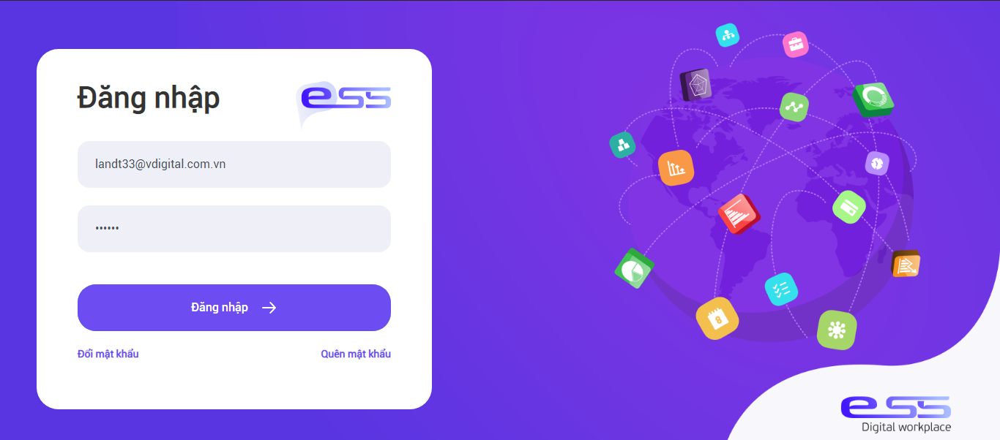
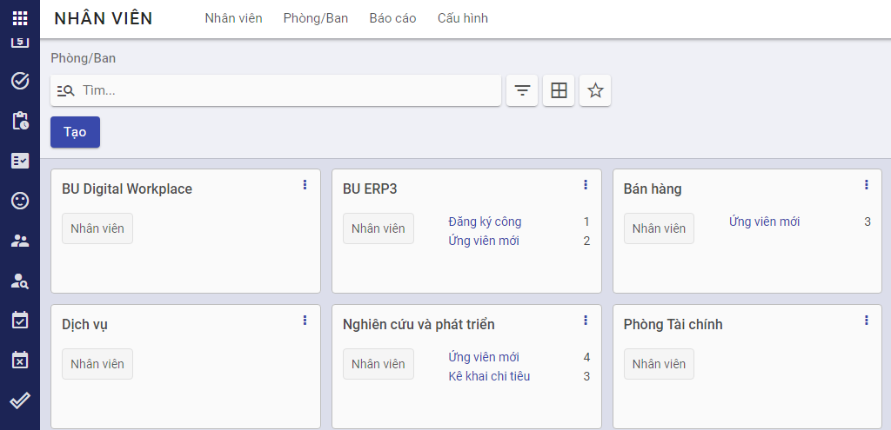

# Hướng dẫn thiết lập và khai báo dữ liệu ban đầu

## Mô tả nghiệp vụ

**Quy trình nghiệp vụ**

- Khách hàng có nhu cầu sử dụng nền tảng vESS, sau khi thực hiện mua tên miền và tài khoản Quản trị viên thành công, khách hàng sẽ được cung cấp một tên miền và tên đăng nhập vào hệ thống
- Khởi tạo ban đầu, khách hàng cần thêm các thông tin về Công ty của mình.
- Sau khi có đầy đủ thông tin về Công ty, khách hàng thực hiện tạo cơ cấu tổ chức, thiết lập cơ cấu phòng ban, bộ phận trong đơn vị, phục vụ cho công tác thống kê và quản lý nhân viên

**Luồng quy trình**

- Luồng mua tên miền và đăng ký tài khoản Quản trị viên. Chi tiết [tại đây](https://ess-system-guide.readthedocs.io/en/latest/saas/saas/)
- Luồng khởi tạo thông tin Công ty. Chi tiết [tại đây](#Công ty)
- Luồng khởi tạo cơ cấu tổ chức. Chi tiết [tại đây](#Đơn vị, phòng ban).

## Hướng dẫn khai báo

### Công ty

**Đối tượng thực hiện:** Quản trị viên

**Các bước thực hiện**

**Bước 1:** Sau khi thực hiện mua tên miền và tài khoản Quản trị viên thành công, khách hàng sẽ được cung cấp một tên miền và tên đăng nhập vào hệ thống.

**Bước 2:** Người dùng truy cập vào phân hệ **Thiết lập>Người dùng và Công ty>Công ty**, tại đây hiển thị tên Công ty mà người dùng đã khai báo khi mua tên miền, không cho phép người dùng **Thêm mới** bất cứ công ty nào, chỉ cho phép **Sửa** thông tin công ty đã đăng ký.

**Bước 3:** Khai báo các **Thông tin chung**, cập nhật **Giới thiệu**, **Logo** công ty theo mong muốn khách hàng và thực hiện **Lưu** lại.

### Đơn vị, phòng ban

**Đối tượng thực hiện:** Quản trị viên

Thiết lập cơ cấu phòng ban, bộ phận trong đơn vị, phục vụ cho công tác thống kê và quản lý nhân viên.

#### **Khai báo cây đơn vị cho đơn vị không có chi nhánh**

Với đơn vị không có chi nhánh, cơ cấu tổ chức của đơn vị được phân ra làm các cấp như sau:

- Cấp thứ nhất: Sau khi đăng ký thành công thì hệ thống tự động tạo tạo một mức cao nhất là mức độ **Công ty**  cấp tổ chức này được thiết lập dựa trên thông tin công ty đã được đăng ký.
- Cấp thứ hai: Cấp tổ chức này là con của cấp tổ chức thứ nhất.
- Cấp thứ n: Cấp tổ chức này là con của cấp tổ chức thứ (n-1)

**Lưu ý**: Nên khai báo đầy đủ cơ cấu tổ chức của đơn vị đến cấp chi tiết nhất để phục vụ cho công tác hạch toán kế toán sau này.

**Các bước thực hiện**

**Bước 1: **Vào phân hệ **Nhân viên**>**Cấu hình**>**Phòng/Ban**.

**Bước 2:** Chọn **Tạo**

**Bước 3:** Khai báo thông tin cơ cấu tổ chức

Tại mục **Cấp độ phòng ban**: chọn mức Phòng ban 

Tại mục **Chi nhánh:** Khi chọn mức Phòng ban ở mục trên, người dùng chọn dữ liệu trong thanh thao tác. Ở đây hệ thống tự động gán dữ liệu mục này chính là tên công ty mà và là mức cao nhất.

Tại mục **Người quản lý:** Chọn người quản lý của phòng ban này.

Tại mục **Phòng/Ban cấp trên:** Chọn cơ cấu tổ chức cấp cha (nếu có)

**Bước 4:** Chọn **Lưu**

#### Khai báo cây đơn vị cho đơn vị có chi nhánh

- Cấp thứ nhất: **Tổng công ty**: Cấp tổ chức này sẽ được chương trình tự động sinh ra ngay sau khi đăng ký thành công. 

- Cấp thứ hai: **Công ty con/Chi nhánh/Văn phòng đại diện/Văn phòng**: Cấp tổ chức này thuộc cấp tổ chức thứ nhất

- Cấp thứ ba: **Trung tâm/Phòng ban/Nhóm**: Cấp tổ chức này có thể thuộc cấp tổ chức thứ nhất hoặc thứ hai.

**Lưu ý**: Nên khai báo đầy đủ cơ cấu tổ chức của đơn vị đến cấp chi tiết nhất để phục vụ cho công tác hạch toán kế toán sau này.

**Các bước thực hiện**

**Bước 1: **Vào phân hệ **Nhân viên**>**Cấu hình**>**Phòng/Ban**.

**Bước 2:** Chọn **Tạo**

**Bước 3:** Khai báo thông tin cơ cấu tổ chức

- Tại mục **Cấp độ phòng ban:** Khai báo cơ cấu tổ chức cho đơn vị khai báo 

- Tại mục **Chi nhánh:** Chọn cơ cấu tổ chức cấp cha.

- Tại mục **Phòng/Ban cấp trên:** Chọn cơ cấu tổ chức cấp cha, có thể chọn hoặc không.

**Bước 4:** Chọn **Lưu**
