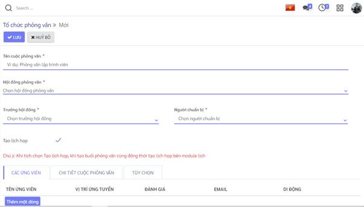
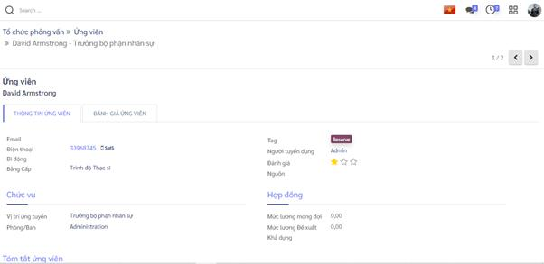
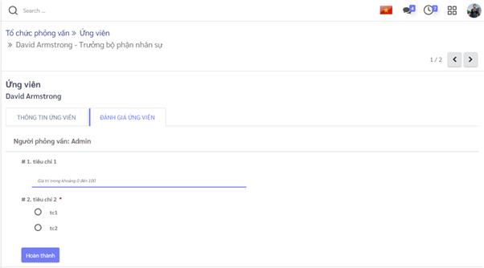

# Quản lý tuyển dụng

Phân hệ Tuyển dụng có chức năng quản lý toàn bộ quá trình tuyển dụng: Từ lúc tạo vị trí công việc có nhu cầu tuyển, đăng tin và tạo form ứng tuyển trực tuyến trên website, tạo và lưu trữ hồ sơ ứng viên, thẩm định sàng lọc hồ sơ, lập lịch thi/phỏng vấn, cập nhật kết quả tuyển dụng và tạo hồ sơ nhân viên sang hệ thống nhân sự khi tuyển dụng thành công. 

## **Mô tả nghiệp vụ**

**Quy trình tổng quan** 

#### **Mô tả nghiệp vụ**

Quá trình tuyển dụng sẽ thực hiện theo quy trình sau:

1. Nhân sự phụ trách tuyển dụng căn cứ theo nhu cầu của đơn vị, phòng ban, tạo thông tin vị trí tuyển dụng, nhu cầu tuyển.
2. Nhân sự phụ trách tuyển dụng đăng tin tuyên dụng cho vị trí cần tuyển lên các website, cho phép ứng viên quan tâm tới có thể ứng tuyển qua mẫu ứng tuyển trực tuyến. 
3. Nhân sự phụ trách tuyển dụng nhận được thông tin các ứng viên, tiến hành thẩm định, đánh giá sàng lọc sơ bộ các hồ sơ ứng viên. 
4. Nhân sự phụ trách tuyển dụng lập lịch thi / phỏng vấn và gửi thư mời tới ứng viên. Hội đồng phỏng vấn thực hiện phỏng vấn và đánh giá ứng viên theo mẫu đánh giá phù hợp với vị trí ứng tuyển. 
5. Nhân sự phụ trách tuyển dụng căn cứ kết quả đánh giá của các vòng thi và phỏng vấn, cập nhật kết quả tuyển dụng. Trường hợp ứng viên đạt yêu cầu sẽ gửi thư trúng tuyển và các thỏa thuận như lương, chế độ... 
6. Với các ứng viên đạt được thống nhất và ký hoàn tất hợp đồng lao động, phụ trách tuyển dụng tạo hồ sơ nhân viên sang hệ thống nhân sự. 

## Tạo vị trí công việc có nhu cầu tuyển dụng

Căn cứ theo nhu cầu tuyển dụng của các đơn vị, phòng ban, người phụ trách công tác tuyển đụng sẽ tạo vị trí tuyển đụng trên hệ thống. Thông tin tuyển dụng sau đó sẽ được đưa lên các trang website tuyển dụng để tiếp cận ứng viên. 

**Đối tượng thực hiện**:  Người phụ trách công tác tuyển dụng

**Các bước thực hiện:**

1. Vào **Cấu hình** -> **Vị trí công việc** hoặc vào **Ứng viên** -> **Theo vị trí công việc**

   

2. Kích nút **Tạo mới** 

3. Nhập thông tin tạo mới vị trí công việc

   - **Tab Mô tả công việc**: các thông tin mô tả chi tiết vị trí công việc tuyển dụng sẽ được hiển thị trên các website tuyển dụng. 

     

   - **Tab Tuyển dụng**: nhập các thông tin chi tiết cho vị trí ứng dụng

     

     - Trang web:  chọn website sẽ đẩy thông tin tuyển 

     - Phòng ban: chọn đơn vị phòng ban có nhu cầu tuyển cho vị trí. 

     - Nhân viên mới dự kiến: nhập số lượng cần tuyển mới cho vị trí này

     - Ngày hết hạn: nhập hạn cuối nhận hồ sơ ứng tuyển của ứng viên

     - Đánh giá: chọn mẫu đánh giá sẽ áp dụng khi đánh giá ứng viên với vị trí công việc này.  Nên thiết lập luôn mẫu đánh giá này nếu đã có mẫu. Trường hợp không thiết lập luôn thì cần có trước khi phỏng vấn đánh giá ứng viên cho vị trí này. 

     - Người tuyển dụng: người phụ trách tuyển dụng cho vị trí này, mặc định là người dùng đang đăng nhập và có thể sửa lại. 

   

   3.  Kích **Lưu**  : Thông tin  về vị trí công việc cần tuyển được lưu lại. 
   4.   Để xem thông tin tuyển của vị trí được đăng tải trên website, kích nút 

## Đăng tin tuyển dụng trên website

Sau khi tạo được thông tin vị trí công việc cần tuyển dụng, người phụ trách công tác tuyển dụng sẽ chọn đăng tin lên website tuyển dụng hoặc không. 

**Đối tượng thực hiện**:  Người phụ trách công tác tuyển dụng

**Các bước thực hiện:**

1. Vào **Ứng viên** -> **Vị trí công việc**

   

2.  Tích chọn  để đăng tin trên website tuyển dụng đã thiết lập 

   Khi đó, hiển thị trạng thái **Đang tuyển** với các vị trí công việc đang đăng tin. 

3. Bỏ tích chọn để không hiển thị tin tuyển dụng trên website đã thiết lập

   Khi đó dòng trạng thái **Đang tuyển** sẽ bị ẩn đi. 

## Tạo mới hồ sơ ứng viên

Hồ sơ ứng viên được tự động tạo trên ứng dụng tuyển dụng khi ứng viên nộp hồ sơ từ website tuyển dụng hoặc người phụ trách tuyển dụng cập nhật thông tin hoặc thêm mới trực tiếp với các trường hợp hồ sơ không nộp qua website. 

**Đối tượng thực hiện**: Người phụ trách tuyển dụng

**Các bước thực hiện:**

1. Vào màn hình **Ứng viên** -> **Hồ sơ xin việc**

   

2. Kích **Tạo mới** 

   

3. Nhập thông tin hồ sơ ứng viên

   - Khai báo các thông tin của ứng viên: tên ứng viên, email, số điện thoại di động 
   - Vị trí ứng tuyển:  chọn vị trí ứng viên muốn ứng tuyển. 
   - Phòng ban: lấy căn cứ theo vị trí ứng tuyển đã chọn
   - Đánh giá: người tuyển dụng đánh giá sơ bộ về ứng viên 

4. Kích **Lưu**

   Hồ sơ ứng viên đã được tạo mới và ở trạng thái ***Thẩm định ban đầu***

5. Để đính kèm thêm CV của ứng viên có 2 cách: 

   - Cách 1: Tại danh sách ứng viên, kích nút đính kèm tại bản ghi ứng viên cần thêm

     Cách 2: vào chi tiết ứng viên, kích nút **Thêm các tệp đính kèm**

   

## Tìm kiếm hồ sơ ứng viên

Người phụ trách tuyển dụng tìm kiếm hồ sơ ứng viên theo nhiều tiêu chí. 

**Đối tượng thực hiện**: Người phụ trách tuyển dụng

**Các bước thực hiện:**

1. Vào màn hình **Ứng viên** ->**Hồ sơ xin việc**

2. Nhập nội dung tìm kiếm theo các tiêu chí vào ô Tìm kiếm

3.  Thực hiện tìm kiếm

   Hiển thị danh sách hồ sơ ứng viên và trạng thái tuyển dụng của ứng viên đó. 

   

## Xem danh sách hồ sơ ứng viên ứng tuyển cho vị trí công việc

**Đối tượng thực hiện**: Người phụ trách tuyển dụng

**Các bước thực hiện:**

1. Vào màn hình **Ứng viên** -> **Theo vị trí công việc**

2. Tại bản ghi vị trí công việc, kích nút **Ứng viên**

   

3.  Hiển thị danh sách hồ sơ ứng tuyển cho vị trí công việc và trạng thái tuyển dụng 

    

## Thêm mới lịch phỏng vấn

Trước mỗi vòng phỏng vấn, người phụ trách tuyển dụng thực hiện sắp lịch phỏng vấn/thi tuyển cho các ứng viên, gửi thư mời đến ứng viên và hội đồng phỏng vấn với địa điểm, thời gian cụ thể ...

**Đối tượng thực hiện**: Người phụ trách tuyển dụng

**Các bước thực hiện:**

1. Vào **Ứng viên** -> **Tổ chức phỏng vấn**
2. Khai báo thông tin Lịch tuyển dụng:

***Lưu ý***

- Nhập Tên cuộc phỏng vấn là bắt buộc
- Tùy chọn **Tạo lịch họp**: 
  - Tùy chọn này hiển thị khi có tích hợp phân hệ Lịch
  - Nếu tích chọn: khi tạo lịch phỏng vấn xong sẽ đồng thời tạo lịch họp trên bên hệ Lịch. 
  - Nếu không tích chọn: Chỉ tạo lịch phỏng vấn ở phân hệ tuyển dụng mà không tạo lịch họp nào trên lịch. 
- Tab ứng viên: 
  - Kích  nút **Thêm một dòng**: để chọn thêm các ứng viên từ danh sách hồ sơ ứng viên
  - Chỉ chọn ứng viên ở trạng thái **Thẩm định ban đầu, phỏng vấn lần 1, phỏng vấn lần 2**
  - Ứng viên có vị trí công việc chưa được thiết lập mẫu đánh giá sẽ hiển thị cảnh báo ***Vị trí công việc chưa được thiết lập mẫu đánh giá*** . Khi đó, trước khi phỏng vấn đánh giá thì cần phải thiết lập mẫu đánh giá cho vị trí này để đánh giá được các ứng viên. 

3. Kích nút “**Lưu**”: tạo lịch phỏng vấn thành công, trạng thái lịch phỏng vấn được tạo là **Mới tạo**

## Gửi thư mời ứng viên tham gia phỏng vấn

Sau khi sắp xếp lịch phỏng vấn, người phụ trách tuyển dụng tiến hành liên lạc với ứng viên để mời tham gia phỏng vấn và chủ động sắp xếp lại lịch phỏng vấn cho phù hợp. 

Mời ứng viên tham gia phỏng vấn có thể thực hiện bằng cách gọi điện và nhận kết quả xác nhận tham gia trực tiếp hoặc gửi email tới ứng viên. 

**Đối tượng thực hiện**: Người phụ trách tuyển dụng

**Để gửi email tới ứng viên theo mẫu**: 

-  Để thực hiện cần phải có thiết lập cấu hình email thực hiện gửi và nội dung mẫu 

**Các bước thực hiện:**

1.  Vào **Ứng viên** -> **Tổ chức phỏng vấn**

2. Kích vào nút **Phỏng vấn** tại buổi phỏng vấn đã đặt lịch

3. Tại danh sách ứng viên, kích nút **...** -> Thông báo

4. Nhập nội dung gửi thư mời phỏng vấn và gửi cho các ứng viên

   - Kích nút **Lưu mẫu mới** để tạo nội dung mẫu tái sử dụng cho lần sau. 
   - Kích nút **Gửi**: để gửi email tới người nhận

   

## Cập nhật quá trình thực hiện lịch phỏng vấn

Người phụ trách tuyển dụng sẽ chuyển lịch phỏng vấn sang trạng thái khác theo tình hình thực hiện lịch phỏng vấn.

**Đối tượng thực hiện**: Người phụ trách tuyển dụng

**Các bước thực hiện:**

1. Vào **Ứng viên** -> **Tổ chức phỏng vấn**

2. Kéo thả các lịch phỏng vấn về các trạng thái tương ứng tình hình lịch thực hiện phỏng vấn

   

- Trạng thái **Dự thảo**: khi mới tạo lịch phỏng vấn 
- Trạng thái **Đã đặt lịch**: khi lịch phỏng vấn đã được sắp xếp tốt như lịch họp đã được duyệt, hội đồng phỏng vấn được mời xong, danh sách ứng viên đã xác định ... 
- Trạng thái **Đang thực hiện**: khi đang thực hiện phỏng vấn. Ở trạng thái này cho phép cập nhật kết quả đánh giá ứng viên. 
- Trạng thái **Đã đóng**: khi buổi phỏng vấn kết thúc, các kết quả đánh giá đã được hoàn thiện. Ở trạng thái này, người dùng không được cập nhật kết quả đánh giá hay trạng thái các ứng viên... 

## Xem và tải tệp CV của ứng viên

Cho phép người dùng xem và tải CV của ứng viên. 

**Đối tượng thực hiện**: Thành viên hội đồng phỏng vấn, người phụ trách tuyển dụng

**Các bước thực hiện:**

1. Vào  **Ứng viên** -> **Tổ chức phỏng vấn**
2. kích nút **Phỏng vấn** 

3. Kích vào bản ghi ứng viên cần đánh giá -> mở màn hình **Chi tiết ứng viên** 

4. Tại phần màn hình thảo luận, kích tải tệp CV của ứng viên nếu có tại phần Tệp đính kèm

   

## Đánh giá ứng viên trong buổi phỏng vấn

Thành viên hội đồng phỏng vấn sẽ ghi lại kết quả đánh giá của mình đối với các ứng viên theo mẫu đánh giá tương ứng. 

**Đối tượng thực hiện**: Thành viên hội đồng phỏng vấn

**Các bước thực hiện:**

1. Vào  **Ứng viên** -> **Tổ chức phỏng vấn**
2. kích nút **Phỏng vấn** 

2. Kích vào bản ghi ứng viên cần đánh giá -> mở màn hình **Chi tiết ứng viên** 

3. Kích các **Tab đánh giá ứng viên:** thực hiện đánh giá ứng viên theo mẫu đánh giá

***Lưu ý***

- Các tiêu chí đánh giá ứng viên hiển thị tùy theo mẫu đánh giá đã được thiết lập cho vị trí ứng tuyển

- Trường hợp vào đánh giá mà hiển thị thông báo chưa có mẫu đánh giá: yêu cầu người phụ trách tuyển dụng vào thiết lập mẫu đánh giá cho vị trí tuyển dụng. 
- Các tiêu chí đánh giá được thiết lập bắt buộc phải nhập kết quả đánh giá thì sẽ có dấu * 

4. kích nút **Hoàn thành**

### Xuất tổng hợp đánh giá ứng viên 

Người phụ trách tuyển dụng có thể xuất báo cáo tổng hợp đánh giá của hội đồng phỏng vấn về các ứng viên sau khi phỏng vấn. 

**Đối tượng thực hiện**: Người phụ trách tuyển dụng

**Các bước thực hiện:**

1. Vào  **Ứng viên** -> **Tổ chức phỏng vấn**

2. kích nút **...**  với lịch phỏng vấn **Đang thực hiện** hoặc **Đã đóng**

3. Kích chọn **Xuất báo cáo**

   

## Cập nhật kết quả tuyển dụng qua các giai đoạn

Người phụ trách tuyển dụng căn cứ kết quả thẩm định hoặc đánh giá phỏng vấn, chuyển hồ sơ ứng viên sang các trạng thái tiếp theo phù hợp. 

**Đối tượng thực hiện**: Người phụ trách tuyển dụng

**Các bước thực hiện:**

1. Vào màn hình **Ứng viên** ->**Hồ sơ xin việc**

2. Tìm kiếm ứng viên cần chuyển trạng thái tuyển dụng

3. Kéo thả bản ghi ứng viên sang cột ứng với trạng thái cần chuyển 

   

   4.  Để cập nhật trạng thái cũng có thể kích vào chi tiết hồ sơ ứng viên -> kích chọn trạng thái tương ứng. 

       

## Ký hợp đồng và tạo thông tin nhân viên 

Khi ứng viên hoàn thành ký hợp đồng lao động với công ty, người phụ trách tuyển dụng sẽ tạo thông tin nhân viên sang hệ thống nhân sự từ thông tin hồ sơ xin việc. 

**Đối tượng thực hiện**: Người phụ trách tuyển dụng

**Các bước thực hiện:**

1. Vào màn hình **Ứng viên** ->**Hồ sơ xin việc**

2. Tìm kiếm ứng viên cần chuyển trạng thái tuyển dụng và tạo nhân viên

3. Kích vào bản ghi ứng viên

4. Tại màn hình **Thông tin ứng viên**, trên thanh trạng thái -> Chọn trạng thái tương ứng cho hoàn tất quá trình tuyển dụng. 

5. Kích nút **Tạo nhân viên**: Chuyển màn hình tạo hồ sơ nhân viên.

   Người phụ trách tuyển dụng nhập các thông tin cần thiết khi tạo nhân viên và lưu lại. Nhân viên được tạo sang hệ thống nhân sự. 

   

## Từ chối tuyển dụng

Khi không đạt được kết quả tuyển dụng hoặc không đạt thỏa thuận hợp đồng hoặc ứng viên từ chối đi làm, người phụ trách tuyển dụng sẽ cập nhật từ chối đối với ứng viên. 

**Đối tượng thực hiện**: Người phụ trách tuyển dụng

**Các bước thực hiện:**

1. Vào màn hình **Ứng viên** ->**Hồ sơ xin việc**

2. Tìm kiếm ứng viên 

3. Kích vào bản ghi ứng viên

4. Tại màn hình **Thông tin ứng viên** : kích nút **Từ chối**  

   

5. Nhập lý do từ chối  và lưu lại

   ***Lưu ý:*** 

   - Lý do từ chối được thiết lập sẵn trong phần **Cấu hình**-> **Lý do từ chối**
   - 

   Hồ sơ ứng viên được đánh dấu **Bị từ chối**

   

## Báo cáo phân tích tuyển dụng

Sau mỗi đợt tuyển dụng hoặc khi phát sinh nhu cầu, người phụ trách tuyển dụng tiến hành lập báo cáo phân tích, thống kê tình hình tuyển dụng của đơn vị.

**Đối tượng thực hiện**: Người phụ trách tuyển dụng

**Các bước thực hiện:**

1. Vào màn hình **Báo cáo** ->**Phân tích tuyển dụng**

2. Chọn hiển thị dạng đồ thị  hoặc dạng danh sách tổng hợp

   - Dạng đồ thị: 

     

   - Dạng danh sách tổng hợp

     

3. Kích vào từng thành phần trong báo cáo tổng hợp để xem danh sách ứng viên chi tiết tương ứng
